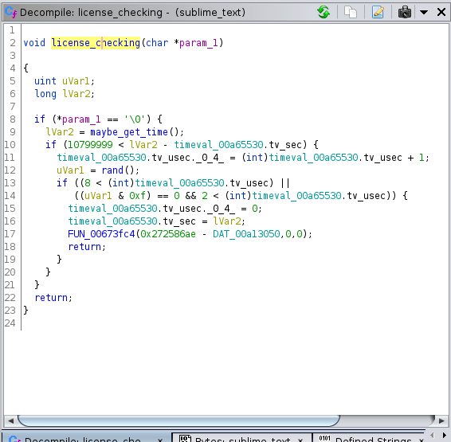
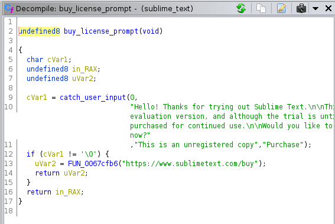
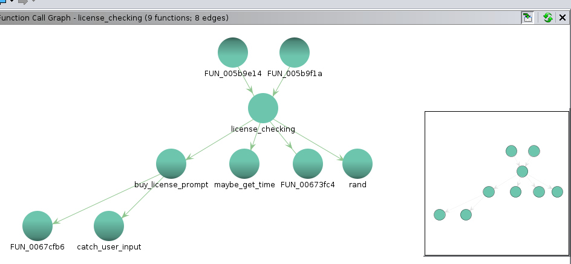
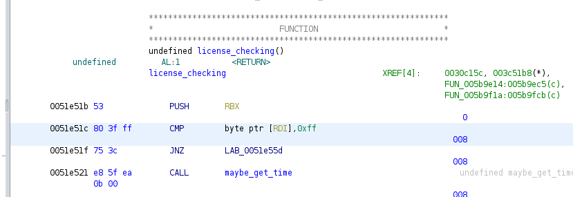

# ST3 ver. 3211

If you use this application for use with the [sublime_zk](https://github.com/bemilton/sublime_zk) plugin and have not purchased a license, you will periodically get a [reminder prompt](https://forum.sublimetext.com/uploads/default/original/3X/9/f/9fb3a4e908acd81299fb2a61c2f4a6626441d2ab.PNG) after _n_ number of ctrl+s keypresses or saves.

And if you do zettelkasten often, it'll happen more often because the prompt is correlated with a time value, the number of saves, or both.

Anyway, you can turn it off by patching the ST3 binary.

## Ghidra

Assuming x86_64 and Linux, open the ST3 binary in Ghidra and navigate to the following addresses:

1. 0051e51b --> license check function



2. 0051e588 --> invitation to buy license prompt



The functions are called `FUN_*` something by default, not what these screenshots show. The relationship is:

 

(2) is _called_ by (1) if the equality test between the first arg of the function to (1) - the pointer `param_1`, returns true against `0x0` which is hex for string value `\0`. This is NUL in ASCII. To a compiler NUL is a macro for different values depending on the data type at the time of compilation (NUL for `char` is evaluated `\0`). If you click `0x0` and select to show the ASCII/bytes instead then it will do so.

So to my elementary C++ knowledge the test is whether the char pointer is either null or the value at the location of the pointer is null. A char/string is terminated with '\0'. So what you want to do in order to turn off the call to the license prompt is patch the instruction for the test against `\0` by substituting it with a value which is unlikely to ever be the value of the variable the char pointer leads to under normal operation of the software, so as to make make the test always fail. When the test fails the function will conveniently execute the `return` at the bottom of the stanza meaning we can patch it so that every time the function gets called it will just do nothing. It is important not to patch more bytes into the binary. Only modify the bytes that're already present.

If you visit the Ghidra project repo, you'll find many complaints regarding Ghidra lacking the capability to patch instructions _and_ export the patch back to the binary _without saving a corrupt binary_ which won't run. So don't use Ghidra's export feature to write the patch to the binary because it's no good. The rebuttal seems to be Ghidra was intended as an analysis tool only and it meets that requirement so this feature has been added to the wishlist for future features. That said, the instruction to be patched is:



`0051e51c 80 3f 00        CMP        byte ptr [RDI],0x0`

And you can do it using a GUI hex editor, such as Bless, but what follows is a command line method to do the patching instead. Ghidra is just to illustrate why it will work: `CMP` is the assembly/assembler instruction `compare` - its operands are the value of the `RDI` register and `0x0` (`\0`). During execution the value of `param_1` will be in the `RDI` register.

The process of binary patching is reading the binary, outputting to hex, patching specific hex values, then going back the other way to output to binary back to the filesystem.

You don't want to overwrite the untouched binary because you should do a diff afterward to make sure the patch only patched exactly what was intended to be patched and nothing else. This is especially important because the tool we'll use is `xxd` which to my knowledge is not POSIX compliant and if you read its [manpage](https://linux.die.net/man/1/xxd) it silently drops read errors. The other tool `od` which performs the same job as `xxd` is POSIX compliant and doesn't report silently dropping any read errors in its [manpage](https://www.man7.org/linux/man-pages/man1/od.1.html) but I'm not using `od` because I am not aware `od` has a switch to reverse hex to binary for writing back to the file system. Other tools will exist to pipe together so as not to need relying on `xxd` but at this time I'm not aware of them, or looking to spend more time researching for an alternative. Doing a diff to make sure the written data is good will suffice.

First, make sure `xxd` isn't going to silently drop anything, by testing it can write a direct copy of the input file:

```
$ xxd -p sublime_text | xxd -r -p > /tmp/terry_tibbs
$ diff -y <(sha1sum sublime_text) <(sha1sum terry_tibs)
5797d1097d357a76c47abadd0db153cb6c57159c  sublime_text        | 5797d1097d357a76c47abadd0db153cb6c57159c  /tmp/terry_tibs
```
Looks identical to me. So next locate the bytes to patch:

```
xxd -c24 -g1 -s 0x31e510 -l 24 sublime_text
0031e510: 31 46 00 48 89 df e8 35 0f 4f 00 53 80 3f 00 75 3c e8 5f ea 0b 00 48 89  1F.H...5.O.S.?.u<._...H.
```
I already know the offset is 0x31e510 because I located it beforehand (piping into `less` and searching for the specific bytes).

Notice the `80 3f 00` in the middle of the string matches the bytes Ghidra displayed for the specific instruction; that's where we're aiming to patch, but it helps to be more specifc because just like looking for a sentence in a text, the less words you use the more false positives you'll return locating what you want. You don't want to patch the incorrect value. So being more specific means it's unlikely there'll be another search hit when you're trying to locate the correct bytes. In Ghidra, note and use the adjacent bytes to pad the search to be exacting: `80 3f 00 75 3c e8 5f`. This is the only search hit in the binary. Good, `00` is the target.

Changing the `00` to `FF` will replace `0x0` with `0xFF` which is an integer value of 255 and the value of some random glyph in the extended ASCII table. I don't think the ST developers will have coded such a possible value for `param_1` so the conditional test should indeed always fail.

But output that line in plain hexdump because we can't work with the right-hand ASCII column `xxd` gives by default when we have to reverse the patch back to binary later:

```
$ xxd -p -c 32 -s 0x31e510 -l 32 sublime_text > subl.patch
$ cat subl.patch
3146004889dfe8350f4f0053803f00753ce85fea0b004889c3482b0500705400
$ sed 's/53803f00753ce85f/53803fff753ce85f/' subl.patch
3146004889dfe8350f4f0053803fff753ce85fea0b004889c3482b0500705400
```

We'll do that flip on the fly:

```
$ xxd -p sublime_text | sed 's/53803f00753ce85f/53803fff753ce85f/' | xxd -r -p > /tmp/sublime_text_patched
$ diff -y --suppress-common-lines <(od -A x -t x1z -v sublime_text) <(od -A x -t x1z -v /tmp/sublime_text_patched)
31e510 31 46 00 48 89 df e8 35 0f 4f 00 53 80 3f 00 75  >1F.H | 31e510 31 46 00 48 89 df e8 35 0f 4f 00 53 80 3f ff 75  >1F.H
```

Since common lines have been suppressed, the output shows a single differences between the original file and the patched binary which is the `ff` where the original has `00`. 

Now you can replace the original binary with the patched one: `mv /tmp/sublime_text_patched /path/to/sublime_text`.
